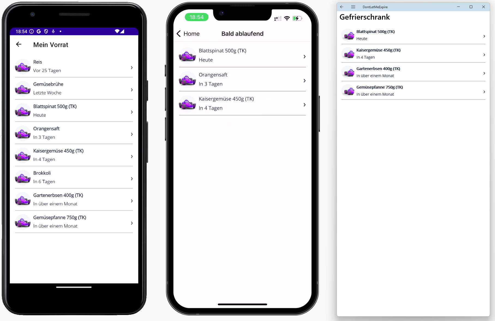
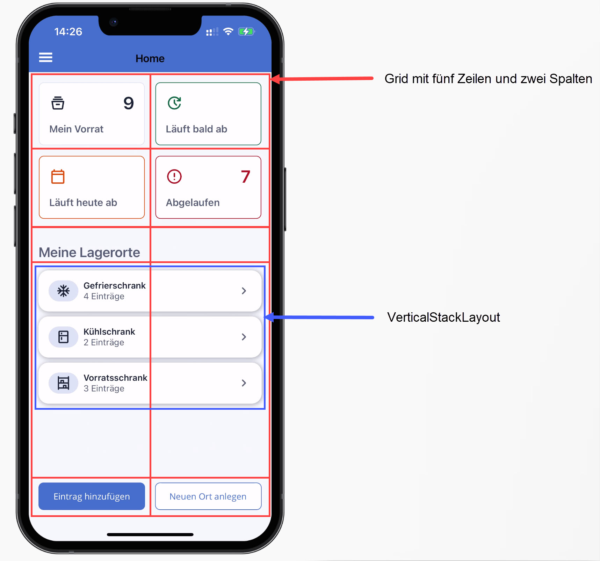

# Übung 2: Layout-Skizze

- Überlegen Sie sich, mit welchen **LayoutContainern** das Grundlayout der Startseite der Demo-App *Don't let me Expire* umgesetzt werden könnte
- Erstellen Sie eine Skizze dazu

[Zur Lösung](#lösung)

Hier das gewünschte Layout

## Lösung

Das gewünschte Layout kann mit einen `Grid` mit fünf Zeilen und zwei Spalten umgesetzt werden. Innerhalb des Grids wird ein `VerticalStackLayout` genutzt, um die Liste der Lagerorte darzustellen.

